# Pneumonia Detection from Chest X-Rays

**Course:** Data Mining | FAST NUCES  
**Dataset:** [Kaggle — Chest X-Ray Images (Pneumonia)](https://www.kaggle.com/datasets/paultimothymooney/chest-xray-pneumonia)  
**Model:** MobileNetV2 Transfer Learning <br>
**Hugging Face:** [pneumonia-detection-model](https://huggingface.co/m-ahmad-butt/pneumonia-detection-model)

**DEMO:**
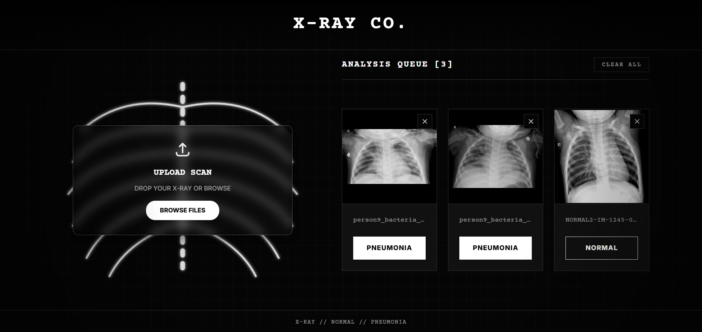 

## 1. Environment Setup

The project runs on **WSL2 (Ubuntu)** with GPU support.  
TensorFlow 2.11+ dropped native Windows GPU — WSL2 is required.

### Install WSL2

```powershell
# Run in PowerShell as Administrator
wsl --install
```

Restart your machine. To open WSL:

```powershell
wsl -d Ubuntu
```

### Create Virtual Environment

The venv must be created in the WSL home directory. Creating on `/mnt/c/` fails due to Windows filesystem permission restrictions.

```bash
sudo apt update && sudo apt install -y python3 python3-pip python3-venv

cd ~
python3 -m venv xray_venv
```

### Activate

```bash
source ~/xray_venv/bin/activate
```

### GPU Setup

Run each session after activating:

```bash
export LD_LIBRARY_PATH=$(find ~/xray_venv -path "*/nvidia/*/lib" -type d 2>/dev/null | tr '\n' ':')$LD_LIBRARY_PATH
```

Make permanent:

```bash
echo 'export LD_LIBRARY_PATH=$(find ~/xray_venv -path "*/nvidia/*/lib" -type d 2>/dev/null | tr '"'"'\n'"'"' '"'"':'"'"')$LD_LIBRARY_PATH' >> ~/.bashrc
source ~/.bashrc
```

Verify:

```bash
python3 -c "import tensorflow as tf; print('GPUs:', tf.config.list_physical_devices('GPU'))"
# Expected: GPUs: [PhysicalDevice(name='/physical_device:GPU:0', device_type='GPU')]
```


## 2. Requirements

```bash
source ~/xray_venv/bin/activate
pip install --upgrade pip
pip install -r requirements.txt
```

**requirements.txt**

```
tensorflow[and-cuda]
opencv-python
numpy
matplotlib
scikit-image
Pillow
seaborn
tqdm
scikit-learn
```


## 3. Dataset

Source: Guangzhou Women and Children's Medical Center, via Kaggle.  
All images are anterior-posterior chest X-rays in JPEG format.

| Split | NORMAL | PNEUMONIA | Notes |
|-------|--------|-----------|-------|
| Train | 1,341 | 3,875 | Imbalanced — ratio 0.35 |
| Val | 8 | 8 | Too small — replaced with 20% split |
| Test | 234 | 390 | Held-out evaluation |

**Class Imbalance Handling**

Data augmentation was trialled but caused NORMAL recall to drop to 0.39. 65% of NORMAL training images became synthetic, and the model learned augmentation artefacts instead of real anatomy. Augmentation was abandoned. Class imbalance is handled entirely through `compute_class_weight('balanced')` in `model.fit()`, which assigns NORMAL a weight of ~1.95 and PNEUMONIA ~0.67.


## 4. Preprocessing Pipeline

The same five-step pipeline is applied identically to train, validation, and test images.

```
Original  →  Bicubic Resize (128×128)  →  Median Blur (k=3)
          →  CLAHE (clipLimit=2.0)     →  Z-Score Normalise  →  Save as .npy
```

### Why .npy and not .png

This was the most critical decision. Saving as uint8 PNG silently undoes z-score normalisation:

```python
# What PNG save does internally:
img = ((img - img.min()) / (img.max() - img.min()) * 255).astype(np.uint8)
# This is min-max rescaling — restores absolute brightness per image
```

The result was a **domain shift of 26.7 intensity units** between train NORMAL (mean 124.9) and test NORMAL (mean 151.6). The model learned brightness as a class proxy. Test NORMAL images from a different scanner were brighter and misclassified as PNEUMONIA.

Saving as float32 `.npy` preserves exact values. After the fix, the domain shift dropped to < 0.1 units.

### Core Function

```python
def preprocess_image(img_path, target_size=(128, 128)):
    img = cv2.imread(str(img_path), cv2.IMREAD_GRAYSCALE)
    img = cv2.resize(img, target_size, interpolation=cv2.INTER_CUBIC)
    img = cv2.medianBlur(img, 3)
    clahe = cv2.createCLAHE(clipLimit=2.0, tileGridSize=(8, 8))
    img = clahe.apply(img)
    img = img.astype(np.float32)
    img = (img - np.mean(img)) / (np.std(img) + 1e-7)
    return img

def save_as_npy(img_array, save_path):
    np.save(str(save_path), img_array.astype(np.float32))
```

### Run

```
Just run pre-processing.ipynb file
```

### Verified Output Stats

| Split / Class | Count | Mean | Std |
|---------------|-------|------|-----|
| Train NORMAL | 1,341 | ~0.00 | ~1.00 |
| Train PNEUMONIA | 3,875 | ~0.00 | ~1.00 |
| Val (20% split) | ~1,050 | ~0.00 | ~1.00 |
| Test NORMAL | 234 | ~0.00 | ~1.00 |
| Test PNEUMONIA | 390 | ~0.00 | ~1.00 |


## 5. Technique Analysis

Twenty-three techniques were evaluated. Each was assessed using visual quality and histogram fidelity. A smooth continuous histogram indicates preserved diagnostic information. Spikes and gaps indicate destroyed information.

> Early-stage pneumonia may appear as only a 3–5 intensity unit difference from healthy tissue. Any technique that clusters or merges nearby intensity values poses a direct diagnostic risk.

### Normalisation

| Technique | Observation | Selected |
|-----------|-------------|----------|
| Min-Max | Sensitive to bright outliers (surgical clips compress useful range to 0.4–0.8) | No |
| **Z-Score** | Robust to outliers; zero-centred; removes inter-scanner brightness differences | **Yes** |

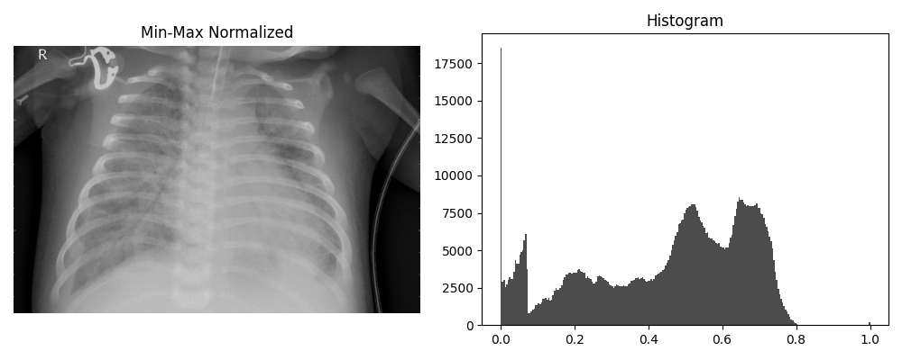


### Denoising

| Technique | Observation | Selected |
|-----------|-------------|----------|
| Non-Local Means | Severe histogram spikes and gaps; 3–5 unit diagnostic gradations destroyed | No |
| Gaussian Blur | Rib and lung edges softened | No |
| Bilateral Filter | Edge-preserving; mild distortion; more complex to tune than Median | No |
| Mean Blur | No edge awareness; most destructive histogram observed | No |
| **Median Blur** | No artificial values created; histogram closest to original; edges preserved | **Yes** |

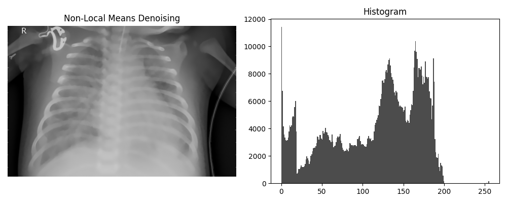
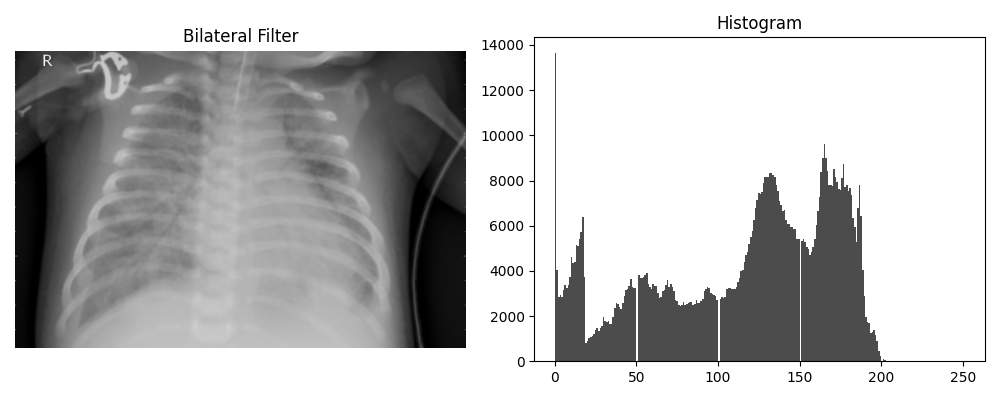
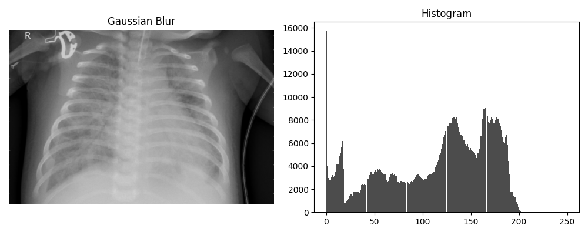

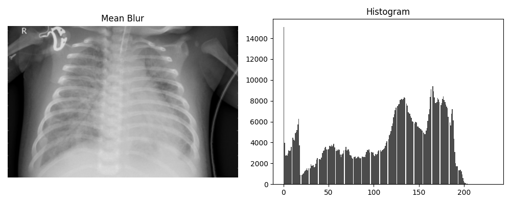

### Sharpening

Both methods were rejected. Pneumonia is diffuse opacity — sharpening amplifies noise to the same degree as real edges and can create false anatomical boundaries.

| Technique | Observation | Selected |
|-----------|-------------|----------|
| Unsharp Masking | Most extreme histogram distortion — spikes >20,000 counts with deep gaps | No |
| Laplacian | Moderate spikes; false boundaries in soft tissue | No |

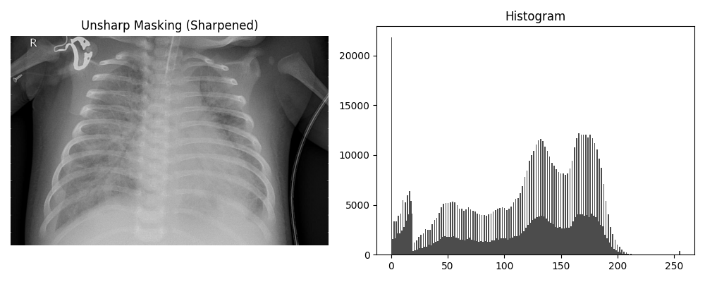
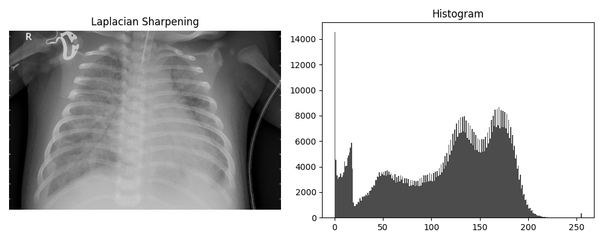

### Edge Detection

All three rejected. Edge detection converts the image to a binary map and discards all soft-tissue information. Pneumonia presents as diffuse cloud-like opacity — the exact information that edge detection removes.

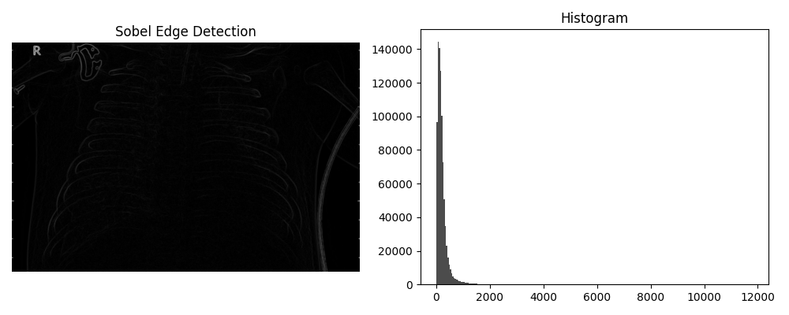
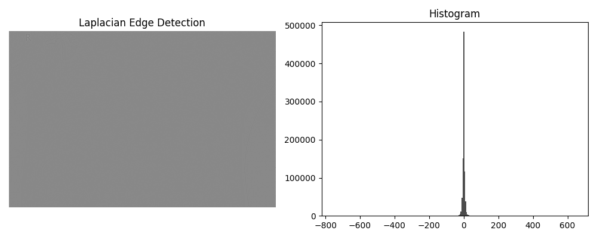
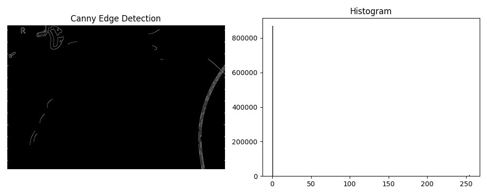

### Contrast Enhancement

| Technique | Observation | Selected |
|-----------|-------------|----------|
| Histogram Equalisation | Extends range beyond original 0–200; creates non-existent pixel values | No |
| **CLAHE** | Local adaptive; preserves intensity range; no artificial values; medical imaging standard | **Yes** |

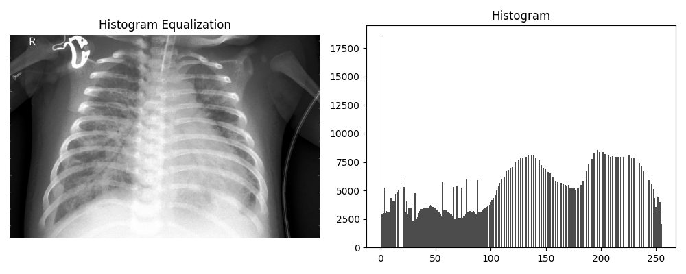
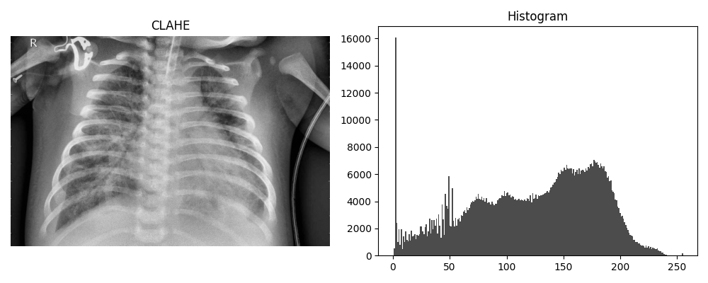

### Resizing

| Technique | Observation | Selected |
|-----------|-------------|----------|
| Nearest Neighbour | Clean histogram; blocky at 128×128 | No |
| Bilinear | Smooth; minor edge softening | No |
| Area | Fragmented histogram; over-brightening | No |
| **Bicubic** | Sharpest result; best intensity gradation preservation at 128×128 | **Yes** |

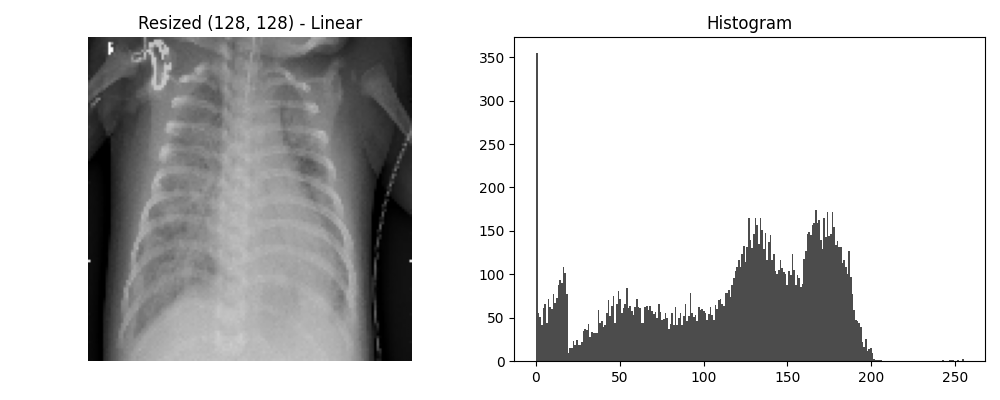

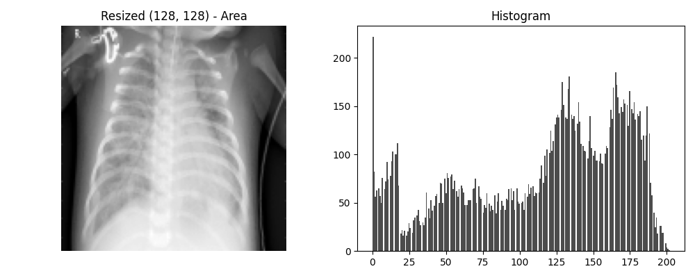


### Selected Pipeline Summary

| Step | Operation | Parameters | Reason |
|------|-----------|------------|--------|
| 1 | Bicubic Resize | 128×128, INTER_CUBIC | Sharpest quality; best gradation preservation |
| 2 | Median Blur | kernel=3 | No artificial values; histogram intact |
| 3 | CLAHE | clipLimit=2.0, tileGridSize=(8,8) | Local contrast; medical imaging standard |
| 4 | Z-Score Normalise | per-image | Brightness-independent; zero-centred |
| 5 | Save as .npy | float32 | Preserves exact z-score values |


## 6. Model Architecture

**MobileNetV2 Transfer Learning** was chosen over a custom CNN.

A custom CNN trained from scratch on ~5,000 images performed poorly (NORMAL recall 0.52 at best). MobileNetV2 was pretrained on 1.4 million ImageNet images and already understands edges, textures, and structural patterns. Fine-tuning it for chest X-ray classification is substantially more effective.

### Hyperparameters

| Parameter | Value | Reason |
|-----------|-------|--------|
| IMG_SIZE | 128×128 | MobileNetV2 minimum 96×96; fits in 6GB VRAM |
| BATCH_SIZE | 32 | Stable gradients |
| Phase 1 LR | 1e-4 | Standard Adam for new head |
| Phase 2 LR | 5e-6 | Very conservative; avoids overwriting ImageNet weights |
| FINE_TUNE_AT_LAYER | 140 | Last 14 of 154 layers — 54 layers caused overfitting |
| L2_LAMBDA | 1e-3 | 10× stronger than initial 1e-4; prevents memorisation |
| DROPOUT_DENSE | 0.60 | Strong head regularisation |
| DENSE_UNITS | 64 | Small head reduces parameter count |
| DECISION_THRESHOLD | 0.70 | Balances NORMAL recall 0.72 and PNEUMONIA recall 0.93 |
| NORMAL weight | 1.95 | Penalises NORMAL errors more |
| PNEUMONIA weight | 0.67 | Lower — PNEUMONIA is majority class |


## 7. Training

### Two-Phase Strategy

**Phase 1 — Head only (base frozen)**

MobileNetV2 base fully frozen. Only Dense head trains. Learns basic NORMAL vs PNEUMONIA separation without touching pretrained weights.

```
Epochs:        20  (early stopping patience=5)
Learning rate: 1e-4
Monitor:       val_auc
```

**Phase 2 — Fine-tuning (last 14 layers)**

Layers 140–154 of MobileNetV2 unfrozen. These learn chest X-ray specific features. Very low LR to avoid destroying ImageNet knowledge. Previous attempts with 54 unfrozen layers caused train loss 0.023 vs test loss 2.8 (severe overfitting). Limiting to 14 layers resolved this.

```
Epochs:          10
Learning rate:   5e-6
Unfrozen layers: 14 of 154
```

### Run Training

```bash
source ~/xray_venv/bin/activate
export LD_LIBRARY_PATH=$(find ~/xray_venv -path "*/nvidia/*/lib" -type d 2>/dev/null | tr '\n' ':')$LD_LIBRARY_PATH
cd /mnt/c/Users/ahmad/Downloads/quiz/DM-Pneumonia-Detection
python3 model/train.py
```

### Training Curves

The green dashed line marks where Phase 2 fine-tuning begins.

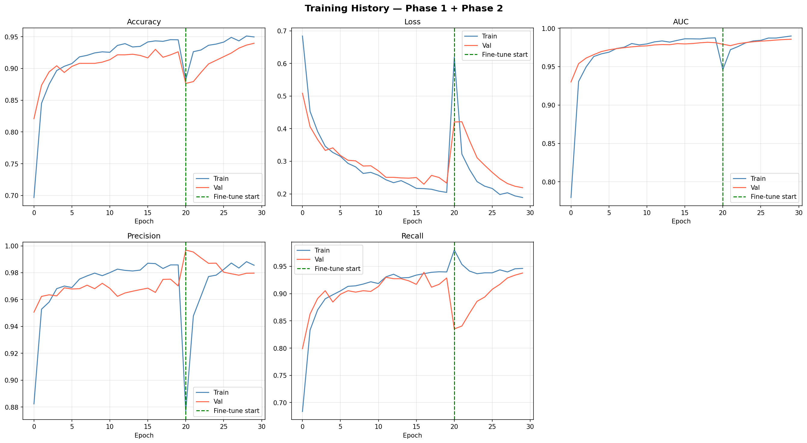

**Phase 1 — Epoch log (selected)**

| Epoch | Train Acc | Val Acc | Train AUC | Val AUC | Val Loss |
|-------|-----------|---------|-----------|---------|----------|
| 0 | 0.697 | 0.821 | 0.780 | 0.930 | 0.509 |
| 5 | 0.908 | 0.903 | 0.969 | 0.972 | 0.318 |
| 10 | 0.925 | 0.914 | 0.980 | 0.977 | 0.271 |
| 15 | 0.942 | 0.917 | 0.986 | 0.980 | 0.250 |
| 19 | 0.945 | 0.926 | 0.988 | 0.981 | 0.233 |

**Phase 2 — Fine-tune epoch log (selected)**

| Epoch | Train Acc | Val Acc | Train AUC | Val AUC | Val Loss |
|-------|-----------|---------|-----------|---------|----------|
| 0 | 0.883 | 0.876 | 0.946 | 0.979 | 0.421 |
| 3 | 0.936 | 0.907 | 0.981 | 0.981 | 0.311 |
| 6 | 0.949 | 0.924 | 0.987 | 0.984 | 0.246 |
| 9 | 0.950 | 0.940 | 0.990 | 0.986 | 0.219 |

### Training Outputs

```
training_logs/
├── training_history_phase1.csv
├── training_history_phase2.csv
├── training_curves.png
├── confusion_matrix.png
└── sample_predictions.png
```

## 8. Results

### Confusion Matrix

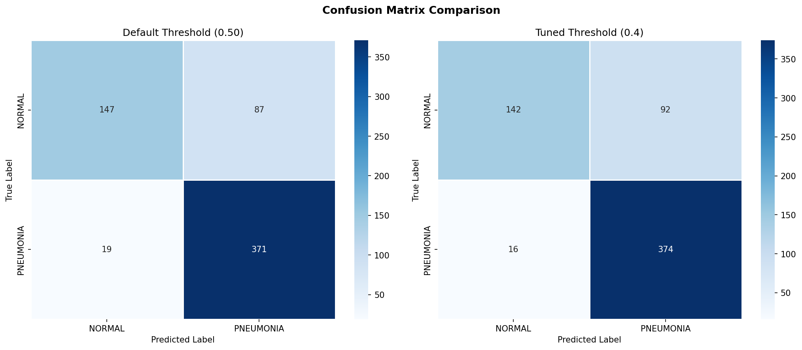
